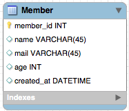
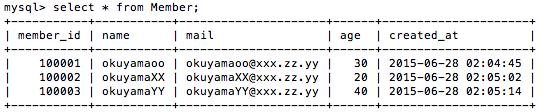

# DbmFs Mount the database as a file system

DbmFsはデータベースをファイルシステムとしファイラーや  
テキストエディタといったツールでデータベースを簡単に  
扱えるように開発をしています。

## 以下で実際にデータベースのデータが どの様にファイルシステムで見えるか説明します。

> データベースに以下のMemberテーブルが存在するとします

> そしてMemberテーブルには以下の3レコードが登録されています

> DbmFsでこのデータベースをマウントすると以下のようになります

このようにDB上のテーブルがディレクトリとして作成され、その中に  
レコードが格納されています。  
リアルタイムにDBの値を反映しているので、DBのテーブルを増やせば  
ディレクトリが増え、レコードが増えるとフォルダが増えます。  
Version-0.0.1ではReadOnlyのためデータ更新はできません。  
またMySQLのみ対応しています。

## install

[依存]
DbmFsはLinuxカーネルモジュールであるFuseを利用して実装されています。  
また実装言語はJavaになり、そのためFuseとJavaのFuseバインディングである  
FUSE-Jに依存しています。

FUSE-J  
http://sourceforge.net/projects/fuse-j/  
Version  
2.4  

> 以下インストール手順

###1.FUSEをセットアップします。  
`$yum install fuse*`  
(devel等も全てインストールしてください)  
※「$modprobe fuse」を行いエラーが出ないことを確認  

###2.FUSE-Jをセットアップ  
###2-1.ダウンロード及び配置  
    $wget http://jaist.dl.sourceforge.net/project/fuse-j/fuse-j/FUSE-J%202.4%20prerelease1/fuse-j-2.4-prerelease1.tar.gz
    $tar -zxvf fuse-j-2.4-prerelease1.tar.gz
###2-2.JNIをセットアップ  
※コンパイル前に build.conf の「JDK_HOME=/opt/jdk1.5.0」が正しいかチェック  
※コンパイル前に jvm_ldpath.def の「LDPATH=」が正しいかチェック  
/opt 配下に jdk1.7.0_79 を配置している場合は以下となる。  

### build.conf

    JDK_HOME=/opt/jdk
    FUSE_HOME=/usr/local
### jvm_ldpath.def

    LDPATH := -L/opt/jdk/jre/lib/amd64/server -L/usr/lib64 -L/lib64 -L/lib -L/usr/lib
### コンパイル
    $cd fuse-j-2.4-prerelease1
    $mkdir build
    $make

※jniディレクトリの配下にlibjavafs.soが作成されていれば成功です。  

###2-3.FUSE-Jをセットアップ
    $pwd
    > fuse-j-2.4-prerelease1
    $ant compile
    $ant dist

※distディレクトリの配下にfuse-j.jarが作成されていれば成功です。

###3.実行環境を用意
libjavafs.so、fuse-j.jar、dbmfs-0.0.1.jarを
上記のファイルを全て適当な1ディレクトリに配置

###4.マウントディレクトリを作成
    $mkdir /var/tmp/dbmfsmnt

###5.マウント

※/usr/local/lib配下にFUSEのライブラリが配置されている想定  
※MySQLがローカルで起動しておりtestというデータベースが存在しrootユーザにてパスワードなしでログイン出来る想定

    $LD_LIBRARY_PATH=./:/usr/local/lib java -classpath ./dbmfs-0.0.1.jar:./fuse-j.jar -Dorg.apache.commons.logging.Log=fuse.logging.FuseLog -Dfuse.logging.level=INFO -Xmx714m -Xms524m -server -XX:+UseConcMarkSweepGC -XX:+CMSParallelRemarkEnabled -XX:+UseParNewGC org.dbmfs.DbmFsMain -f -o allow_other -o big_writes -o max_read=1300000 /var/tmp/dbmfsmnt -dburl jdbc:mysql://localhost/test -dbuser root  

※接続ユーザにパスワードが設定されている場合は-dbpassを引数に付加  

    LD_LIBRARY_PATH=./:/usr/local/lib java -classpath ./dbmfs-0.0.1.jar:./fuse-j.jar -Dorg.apache.commons.logging.Log=fuse.logging.FuseLog  -Dfuse.logging.level=INFO -Xmx714m -Xms524m -server -XX:+UseConcMarkSweepGC -XX:+CMSParallelRemarkEnabled -XX:+UseParNewGC org.dbmfs.DbmFsMain -f -o allow_other -o big_writes -o max_read=1300000 /var/tmp/dbmfsmnt -dburl jdbc:mysql://localhost/test -dbuser root -dbpass password  

　  

###6.アンマウント

    $kill -9 実行プロセス
    $fusermount -u /var/tmp/okufs
